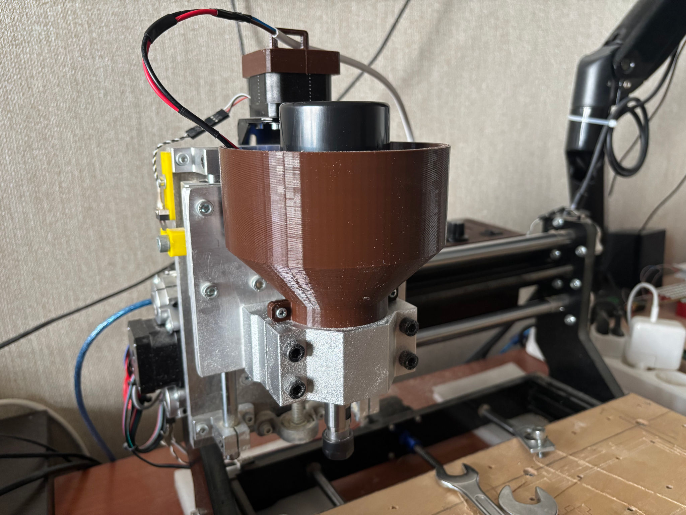
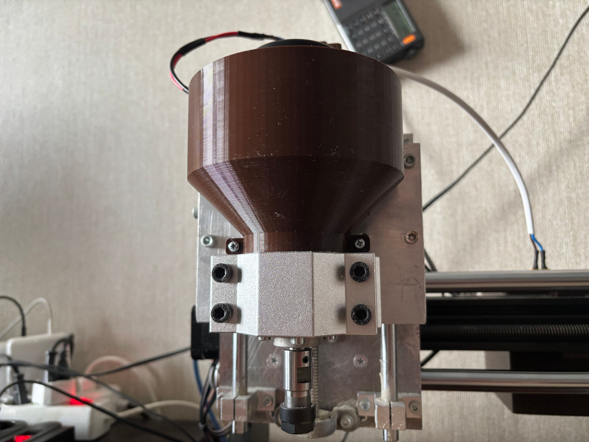
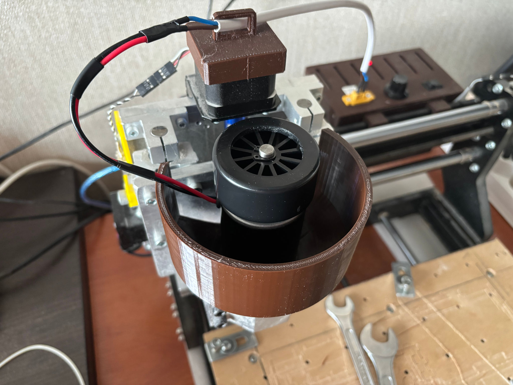

# CNC Spindle Air Deflector

## Description

Chinese 52 mm air-cooled CNC spindles are a popular choice among hobbyists. However, a common issue is that the cooling
fan scatters shavings all over the workspace, which can be particularly bothersome — especially when operating the
machine in a shared or indoor environment.

This project offers a 3D-printed air deflector that mounts directly onto the spindle. It redirects the airflow away from
the cutting area while still maintaining proper cooling of the spindle.

## See also

- [Project on Thingiverse](https://www.thingiverse.com/thing:7041669).

## Authors

- [Oleksandr Shepetko](https://shepetko.com).

## License

This project is licensed under the MIT License. See the [LICENSE](LICENSE) file for details.
